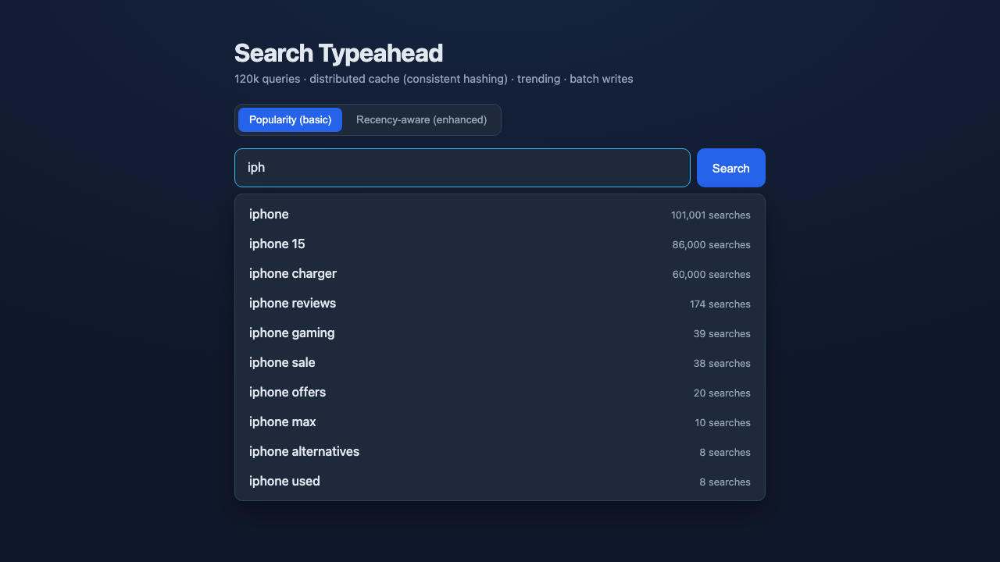
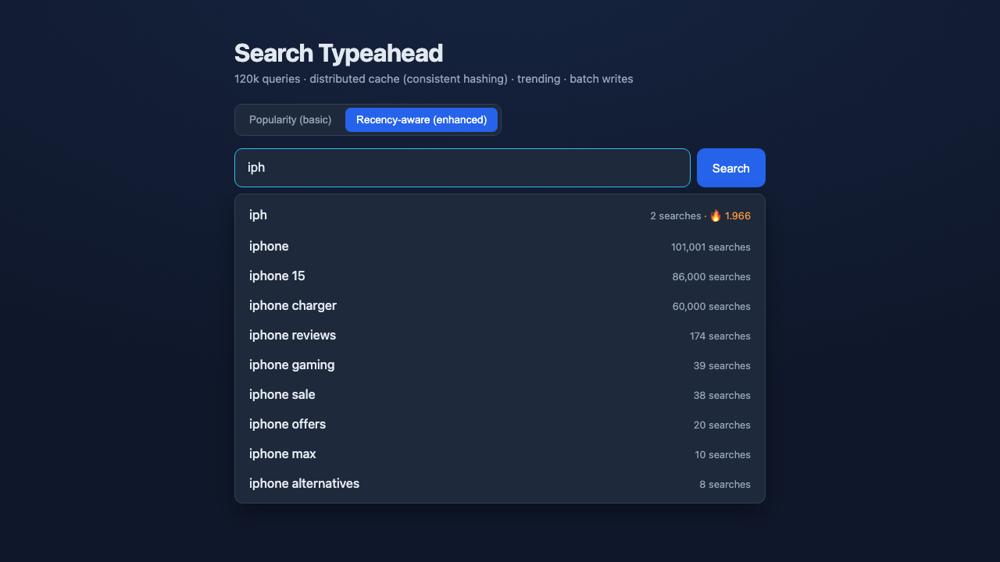

# Search Typeahead System

A search typeahead (autocomplete) system: it suggests popular queries as you
type, records submitted searches, and serves suggestions with low latency from
a **distributed cache** routed by **consistent hashing**. It supports
**trending searches** (recency-aware ranking) and **batch writes** to keep the
database from being hammered on every keystroke-search.

Built to the assignment spec: `GET /suggest`, `POST /search`,
`GET /cache/debug`, a React UI, SQLite primary store, distributed cache with
consistent hashing, trending, and batch writes.

---

## 1. Quick start

Requirements: **Node 18+** (tested on Node 20).

```bash
# from the project root
npm install                 # installs concurrently (for the dev script)
npm run install:all         # installs backend + frontend deps
npm run seed                # generates the dataset (120k queries) + loads SQLite

# Option A — one-command demo (backend serves the built UI on :3001)
npm run build               # builds the React UI into frontend/dist
npm start                   # http://localhost:3001

# Option B — dev mode (hot reload): backend on :3001, UI on :5173
npm run dev                 # then open http://localhost:5173
```

Measure performance (server must be running):

```bash
npm run benchmark
```

---

## 2. Dataset

- **Source:** generated locally by [`backend/src/seed.js`](backend/src/seed.js).
  The PRD allows any dataset and permits deriving counts by aggregation.
- **How counts are derived:** queries are built by combining real brand /
  product / tech vocabulary across several query templates, then assigned
  counts from a **Zipf-like (power-law) distribution** — a few head queries are
  searched enormously, a long tail barely at all. This matches how real search
  traffic is shaped.
- **Reproducible:** a fixed PRNG seed (mulberry32, seed `42`) means every run
  produces the exact same dataset.
- **Size:** 120,000 unique queries (> the 100k minimum).
- **Output:** `backend/data/queries.csv` (columns `query,count`) and the SQLite
  DB `backend/data/typeahead.db`.

Loading: `npm run seed` writes the CSV and bulk-inserts into SQLite in one
transaction. The server reads the table **once at startup** to build the
in-memory trie; after that, suggestion reads never touch the DB.

---

## 3. Architecture

See [docs/ARCHITECTURE.md](docs/ARCHITECTURE.md) for the full diagram and data
flows. In short:

```
        ┌─────────────┐   GET /suggest   ┌──────────────────────────────────┐
        │  React UI   │ ───────────────▶ │  Express                         │
        │ (debounced) │                  │   │                              │
        └─────────────┘ ◀─────────────── │   ▼                              │
              │  POST /search             │  SuggestionService               │
              │                           │   ├─ DistributedCache ──┐        │
              ▼                           │   │   (consistent hash) │ 4 nodes│
        suggestions / trending           │   ├─ Trie (prefix index)│        │
                                          │   ├─ RecencyTracker     │        │
                                          │   └─ BatchWriter ──┐    │        │
                                          └────────────────────┼────┼───────┘
                                                               ▼    (cache miss)
                                                          SQLite primary store
```

- **Read path** (`GET /suggest`): cache → (miss) trie → rank → fill cache.
- **Write path** (`POST /search`): live count + live recency + buffered DB write.
- **Flush path** (timer/size): persist batch to SQLite → refresh trie →
  invalidate affected cache keys.

---

## 4. API documentation

Base URL: `http://localhost:3001`

### `GET /suggest?q=<prefix>&mode=count|recency`
Returns up to 10 prefix-matching suggestions sorted by ranking.
- `q` — the typed prefix (case-insensitive; empty/missing → empty list).
- `mode` — `count` (basic, all-time popularity, default) or `recency`
  (enhanced, blends popularity with recent activity).

```json
{
  "query": "iph", "mode": "count", "source": "cache",
  "cacheNode": "cache-node-0", "count": 10, "latencyMs": 0.18,
  "suggestions": [{ "query": "iphone", "count": 100001 }, ...]
}
```
`source` is `cache` (hit), `compute` (miss → built from trie), or `empty`.

### `POST /search`  body `{ "query": "iphone" }`
Records the search and returns the dummy response. Increments the count if the
query exists, inserts it with an initial count if not.
```json
{ "message": "Searched", "query": "iphone", "count": 100002 }
```

### `GET /cache/debug?prefix=<prefix>&mode=count|recency`
Shows which cache node owns the prefix key and whether it is currently a hit or
miss (non-mutating).
```json
{ "prefix": "iph", "key": "sug:count:iph", "node": "cache-node-0", "status": "hit" }
```

### `GET /trending`
Top trending searches by decayed recent activity.
```json
{ "trending": [{ "query": "iphone", "recencyScore": 12.4, "count": 100050 }] }
```

### `GET /metrics`
Cache hit rate (overall + per node), batch-write counters, DB read/write
counts, consistent-hashing key distribution, and `/suggest` latency
percentiles (p50/p95/p99). Used by the benchmark and for the performance report.

---

## 5. Design choices & trade-offs

**Primary store — SQLite.** A real on-disk DB so DB read/write counts are
genuine. WAL + `synchronous=NORMAL` make batched writes fast while staying
durable enough for the demo.

**Suggestions — in-memory trie with a precomputed candidate pool.** Each trie
node caches the top-N (50) highest-count queries under that prefix, so
`/suggest` is O(prefix length), never a full scan. The pool is bigger than the
10 we return so the recency re-ranker has room to promote a trending query.
*Trade-off:* a query ranked below the 50th by count can't be surfaced by
recency for that prefix — bounded memory & latency vs. perfect freshness.

**Cache — distributed, consistent-hashed.** 4 logical cache nodes; a consistent
hash ring with 150 virtual nodes per node decides ownership. Same prefix always
routes to the same node (affinity), and adding/removing a node only remaps
~1/N of keys. Each node has TTL (30s) + an LRU bound so stale data can't live
forever. *Trade-off:* in-process logical nodes keep the demo runnable on one
machine; in production each node would be a separate Redis/Memcached box behind
the same ring logic (unchanged).

**Trending — time-decayed recency score.** Each query keeps one
exponentially-decayed counter (10-min half-life). Updated live on every search,
so trending feels real-time. Decay means a short viral spike fades on its own —
this is exactly how the system **avoids permanently over-ranking** a
briefly-popular query. Enhanced ranking blends:
`score = 1.0·log10(count+1) + 3.0·recencyScore`.

**Batch writes.** Search submissions land in an in-memory buffer keyed by query
(so 50 searches for "iphone" aggregate into one `+50`). The buffer flushes on a
2s timer **or** at 500 buffered increments, as a single SQLite transaction.
*Failure trade-off:* the buffer is in memory, so a crash before a flush loses at
most the last interval's increments. That's acceptable for popularity counters;
if counts had to be exact we'd add a write-ahead log before acknowledging.

**Cache invalidation on ranking change.** When a search is recorded and later
flushed, the cached results for every prefix of that query are invalidated (in
both modes) so the next read recomputes fresh rankings; TTL covers everything
else.

---

## 6. Performance report

Measured locally with `npm run benchmark` (Node 20, 120k-query dataset, 4 cache
nodes). Numbers will vary by machine; reproduce with the command.

| Metric | Result |
| --- | --- |
| Suggestion latency — warm (cache hit) | p50 ≈ 0.11 ms, **p95 ≈ 0.5 ms** (HTTP round-trip) |
| Suggestion latency — cold (compute)   | p50 ≈ 0.17 ms, p95 ≈ 0.5 ms |
| Server-side `/suggest` compute        | p50 0.003 ms, **p95 0.008 ms** |
| Cache hit rate (after warm-up)        | **≈ 98%** |
| Batch writes: 5,031 searches          | → **57 DB rows written** across 13 flushes |
| Write reduction via batching          | **≈ 98.9%** fewer DB writes |
| Consistent-hashing distribution (676 keys / 4 nodes) | ≈ 181 / 184 / 153 / 158 (even) |

**Cache vs DB reads:** suggestion reads are served entirely from the trie +
cache; the DB is read only once at startup. So the DB read count stays flat
regardless of query volume.

---

## 7. Demonstrating basic vs. enhanced ranking

In the UI, toggle **Popularity (basic)** vs **Recency-aware (enhanced)**, or via API:

```bash
# burst-search a low-count tail query
for i in $(seq 1 30); do curl -s -XPOST localhost:3001/search \
  -H 'content-type: application/json' -d '{"query":"iphone sale"}' >/dev/null; done
sleep 3
curl -s "localhost:3001/suggest?q=iph&mode=count"    # "iphone sale" stays near the bottom
curl -s "localhost:3001/suggest?q=iph&mode=recency"  # "iphone sale" jumps to the top, then decays
```

---

## 8. Screenshots

| Popularity (basic) ranking | Recency-aware (enhanced) ranking |
| --- | --- |
|  |  |

In recency mode a freshly-searched, low-count query is promoted to the top
(🔥 badge), while popularity mode keeps the all-time leaders first.

## 9. Project layout

```
backend/
  src/
    config.js            all tunables (cache size, TTL, weights, batch sizes)
    seed.js              dataset generator + loader
    db.js                SQLite store + batched upserts + metrics
    trie.js              prefix index with per-node top-N pool
    consistentHash.js    hash ring with virtual nodes
    distributedCache.js  logical cache nodes (TTL + LRU) routed by the ring
    recency.js           time-decayed recency scores + trending
    batchWriter.js       buffer → aggregate → periodic/size flush
    suggestionService.js wiring of all of the above (read/write/flush paths)
    server.js            Express routes + serves the built UI
    benchmark.js         performance harness
  data/                  generated CSV + SQLite DB
frontend/
  src/                   React UI (App.jsx, api.js, styles.css)
docs/ARCHITECTURE.md
```
# HLD_assignment
